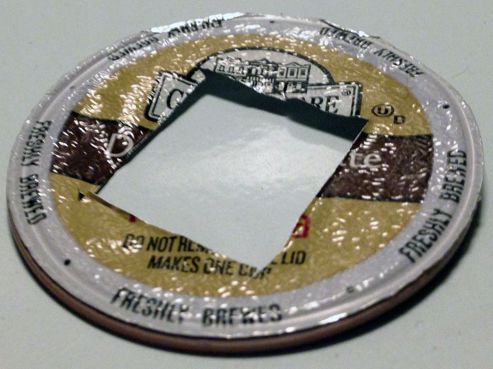
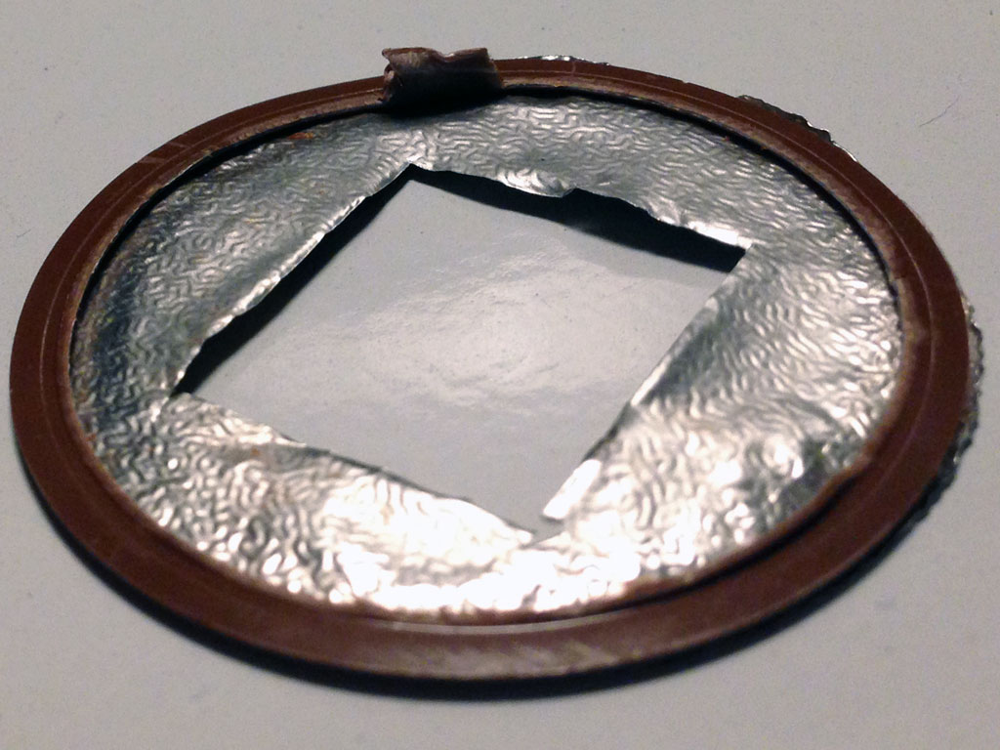
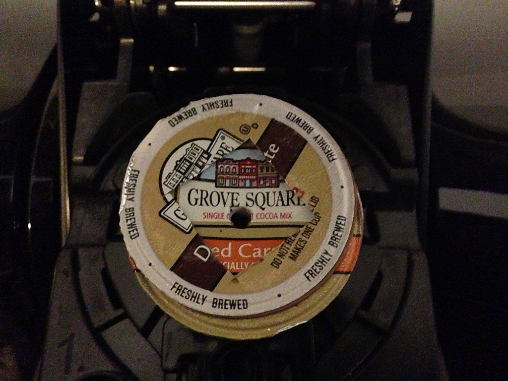
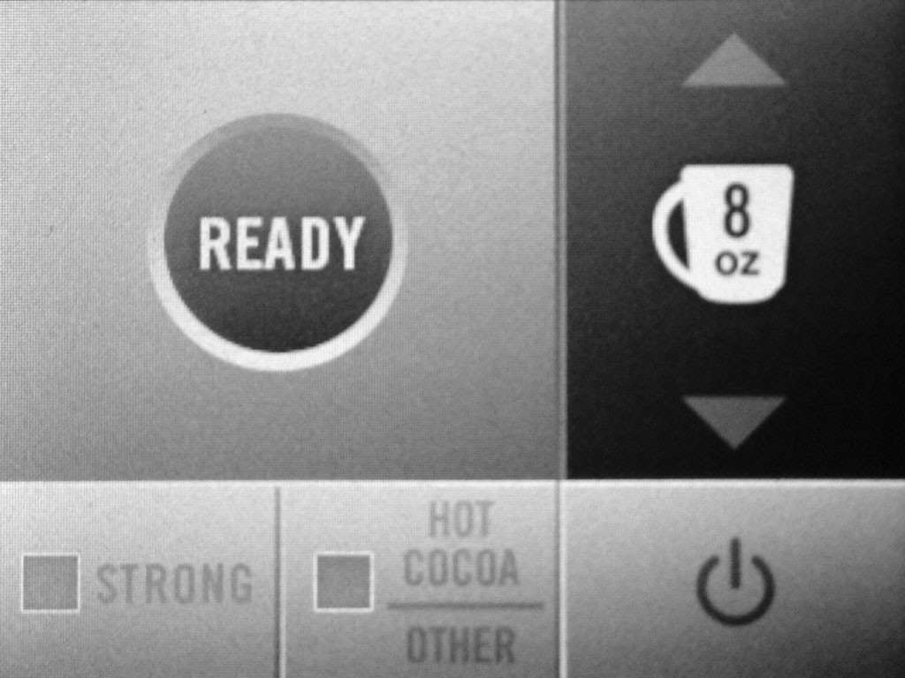

# fuck_you_keurig_2.0
Summary: Soft-mod and Hard-mod description to fix the broken by design Keurig 2.0.

= Problem =

Greed corrupts everything.

When you use an non "authorized" K-cup you get this shenanigans "Oops" message.

= Solutions =

== Hard Mod ==

1. Cut the green wire

For more detailed instructions search You-Tube for: ["Keurig 2.0 hack"](https://www.youtube.com/results?search_query=keuring+2.0+hack)

== Soft Mod ==

1. Use one official Keurig "authorized" K-cup.  Keep it from becoming damaged.
2. Turn it upside down.
3. Make a "shim" with an X-Acto hobby knife by cutting off everything "above" the plastic O-ring.
4. Cut a hole/square in the middle.

Since a picture is worth a thousand words ...

To use the shim:

1. Lift lid
2. Insert "non-authorized K-cup"
3. Put the shim over top
4. Close the lid.

 

5. Give Keurig the middle finger for not respecting your time, space, or money.

 

6. Enjoy your beverage.

== How it works ==

The white ring is encoded with data that identifies the manufactor and type of K-cup.
This "hack" tricks the sensor to "see" (read) the "authentic" white O-ring
making it "think" that the non-authentic K-Cup is actually authentic.

= Summary =

Congratulations humanity for reaching a new low on stupidity in 2014:

    DRM on Coffee / Tea / Hot Choculate? WTF!

There is only one appropriate (consumer) answer:

    Fuck You Keurig 2.0.

